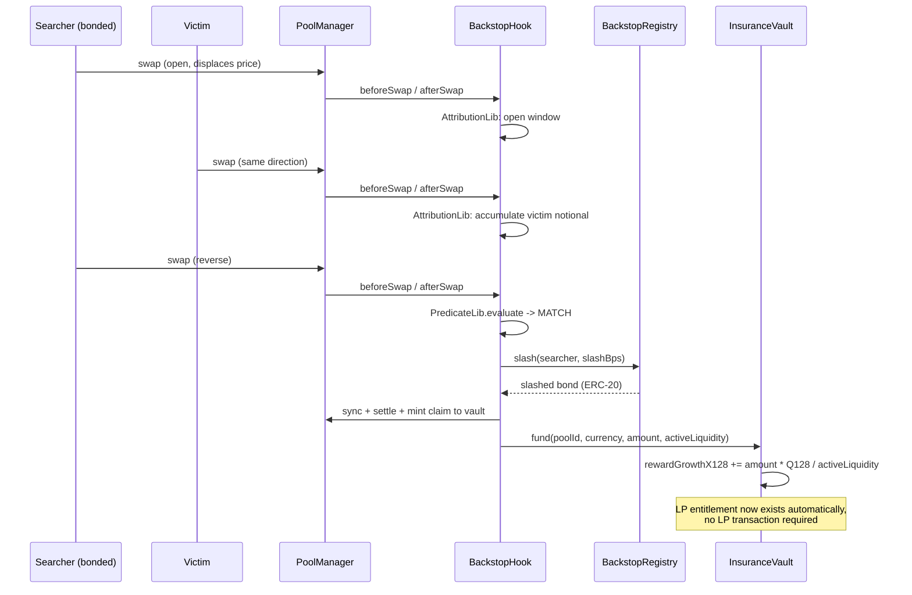

# Backstop

**The attacker funds the insurance that pays the LP.**

A Uniswap v4 hook where searchers bond capital for priority-lane access to a protected pool. A
priority tax funds an LP insurance reserve continuously; when a searcher's own swaps, within a
single transaction, match a narrowly-defined **same-transaction displacement-and-reversal
pattern**, their bond is slashed into that reserve and LPs' entitlement increases automatically —
no claim filed, no oracle, no AVS.

> Backstop detects a narrowly defined, objectively observable same-transaction pattern. It does
> not detect sandwiches in general, does not infer intent, and does not attribute across
> transactions or addresses. See [SECURITY.md](SECURITY.md) and
> [MECHANISM.md](MECHANISM.md) for exactly what is and isn't guaranteed.

## Deployed instance (Unichain Sepolia)

All four contracts below are deployed and **source-verified** on Uniscan.

| Contract | Address | Verified source |
|---|---|---|
| BackstopHook | `0x37Cbf59e9A03a303d8B9409c3151374b08f10ac8` | [uniscan.xyz](https://sepolia.uniscan.xyz/address/0x37Cbf59e9A03a303d8B9409c3151374b08f10ac8#code) |
| BackstopRegistry | `0x64725eE80dA8d86b790b52F3c016a3b10c485D54` | [uniscan.xyz](https://sepolia.uniscan.xyz/address/0x64725eE80dA8d86b790b52F3c016a3b10c485D54#code) |
| InsuranceVault | `0xbc371b61052B4811424643cA41E9A4aFC94dc58e` | [uniscan.xyz](https://sepolia.uniscan.xyz/address/0xbc371b61052B4811424643cA41E9A4aFC94dc58e#code) |
| PoolManager | `0x9B851BA8a469314EAafDDa5A0DD46B309E34cbd0` | [uniscan.xyz](https://sepolia.uniscan.xyz/address/0x9B851BA8a469314EAafDDa5A0DD46B309E34cbd0#code) |
| currency0 (bond asset, demo token) | `0x309C14339f77671305C1A8d020E9E081c6336251` | — |
| currency1 (demo token) | `0x63Dbb10EA994AAc43D1E94d5429B4f28DfFC8BDa` | — |

Deployed via `script/Deploy.s.sol`, wiring and initialization independently confirmed on-chain
(not just trusted from the script's own log) via `cast call` against `registry.hook()` /
`vault.hook()`. Uniscan is Etherscan's own explorer for Unichain Sepolia (chain id `1301`), served
through their unified V2 multichain API — a plain etherscan.io API key verifies here, not a
separate Uniscan-specific one; see `foundry.toml`'s `[etherscan]` section.

## Documents

| Doc | What's in it |
|---|---|
| [ARCHITECTURE_VALIDATION.md](ARCHITECTURE_VALIDATION.md) | What was verified against the actual installed v4-core source before any contract was written, and every place the original brief's assumptions were corrected, with evidence |
| [MECHANISM.md](MECHANISM.md) | The full economic/state model: actors, the transient-storage state machine, the predicate, bond/tax/slash/payout math, invariants, and the full false-positive case bank |
| [ARCHITECTURE.md](ARCHITECTURE.md) | Contract responsibilities, storage layout, callback flow, why three contracts instead of one |
| [SECURITY.md](SECURITY.md) | Self-audit: findings fixed during development (with the fuzz counterexamples that found them), the full threat-model table, and stated limitations |

## Why same-transaction, not same-block

The classic mempool sandwich (searcher tx → victim tx → searcher tx, ordered by a builder) is
**out of scope** — there is no EVM primitive that lets one transaction observe another, and any
attempt to reconstruct that cross-transaction link from persistent storage reopens the false-
attribution risk the whole design exists to avoid. What Backstop *can* prove is the pattern where
a router, aggregator, intent-solver, or batch-filler executes multiple parties' swaps atomically
inside one `PoolManager.unlock()`-bracketed transaction — a real, current v4-native attack surface,
not a hypothetical. See ARCHITECTURE_VALIDATION.md §5 for the full reasoning; this is also why the
original brief's "same-block" language was corrected to "same-transaction" everywhere in this repo.

## How it works



LPs claim their entitlement whenever they like via `InsuranceVault.claim(...)` — an O(1) pull,
never a same-instruction push to every LP (there is no iteration anywhere in the settlement path;
see ARCHITECTURE_VALIDATION.md §6 for why that's a hard requirement, not a nice-to-have).

## Repository layout

```
src/
  BackstopHook.sol          v4 hook: tax, attribution, predicate, settlement, checkpointing
  BackstopRegistry.sol      bond custody: deposit / withdraw / slash / eligibility
  InsuranceVault.sol        ERC-6909 reserve + growth-index LP entitlement + claim
  libraries/
    AttributionLib.sol      transient per-pool window state machine
    PredicateLib.sol        pure math: displacement / reversal / match
    BondLib.sol             pure math: tax sizing, slash sizing
    InsuranceLib.sol        pure math: growth-index update / entitlement
  interfaces/, types/
script/
  Deploy.s.sol              deploys + wires + initializes the protected pool
  Demo.s.sol                deterministic on-chain "wow moment" (see below)
  DemoRouter.sol            minimal actor contract used only by Demo.s.sol
test/
  unit/                     pure-math + registry unit and fuzz tests
  integration/               real-PoolManager tests: the full predicate case bank, tax, claiming
  invariant/                 handler-driven registry solvency invariant
  utils/Bundler.sol          minimal multicall bundler -- makes multi-leg test/demo sequences
                             genuinely one transaction (see ARCHITECTURE_VALIDATION.md §8)
```

## Build & test

```bash
forge build
forge test                 # 45 tests: unit, integration (real PoolManager), invariant
forge test --isolate       # same 45, with every top-level call as its own real transaction
forge test --gas-report    # gas profile
```

The integration suite (`test/integration/BackstopHook.t.sol`) runs the entire false-positive /
true-positive case bank from MECHANISM.md against a real deployed `PoolManager` and two distinct
router identities — not mocks. It includes the classic sandwich (Case C), multi-victim
accumulation (Case E), two-independent-searchers non-interference (Case F), and partial-reversal
non-match (Case H), plus LP claiming and double-claim prevention.

**All 45 tests pass identically under both `forge test` and `forge test --isolate`.** That
equivalence is itself a load-bearing result, not a formality — see ARCHITECTURE_VALIDATION.md §8
for the bug this caught (an earlier version of this suite only passed under Foundry's default,
non-isolated execution, which does not correctly represent separate on-chain transactions).

## Deploying

```bash
cp .env.example .env   # fill in PRIVATE_KEY, CURRENCY0/CURRENCY1, RPC URL
forge script script/Deploy.s.sol:Deploy --rpc-url $UNICHAIN_SEPOLIA_RPC_URL \
  --private-key $PRIVATE_KEY --broadcast -vvvv
```

This mines a CREATE2 salt for the exact hook-permission bits Backstop needs, deploys
`BackstopRegistry` → `InsuranceVault` → `BackstopHook` in that order (the hook's constructor needs
the other two's addresses; see ARCHITECTURE.md for why `hook` is wired post-deploy rather than
being a plain `immutable`), wires them together, and initializes the protected pool.

**This script was validated end-to-end against a local Anvil chain** (deploy, hook mining, wiring,
pool initialization all confirmed on-chain) but has **not** been broadcast to a live network as
part of this engineering pass — that's a deliberate action for whoever holds the funded deployer
key to take, not something to run silently.

## Demo

```bash
# after Deploy.s.sol, paste its printed addresses into .env, then:
forge script script/Demo.s.sol:Demo --rpc-url $UNICHAIN_SEPOLIA_RPC_URL \
  --private-key $PRIVATE_KEY --broadcast -vvvv
```

Constructs the exact same-transaction sandwich pattern deterministically — no waiting on mempool
activity, no bots (per the brief's "Demo Safety" requirement). The three swap legs are routed
through a minimal `Bundler` contract as **one** transaction — see ARCHITECTURE_VALIDATION.md §8 for
why that's load-bearing, not stylistic: `forge script` broadcasts each top-level call as its own
separate transaction, and an earlier version of this script that called the three legs directly
looked successful in its own console output (which comes from local simulation) while doing
*nothing* on the actual chain, because EIP-1153 transient storage correctly clears between
genuinely separate transactions.

Numbers below were confirmed **independently via `cast call` against the live contracts after a
real broadcast completed** — not read from the script's own log — on a local Anvil chain with each
transaction forced into its own separate block (`--slow`):

```
registry.bond(searcherRouter)  before: 1000000000000000000000
registry.bond(searcherRouter)  after:   800000000000000000000   <- real, on-chain 20% slash
```

## What this is not

No oracle. No AVS. No claim to detect sandwiches in general or to prove intent. No claim to catch
cross-block or cross-address MEV. See MECHANISM.md's "Failure modes" and SECURITY.md's "Known
limitations" for the complete, honest list.
